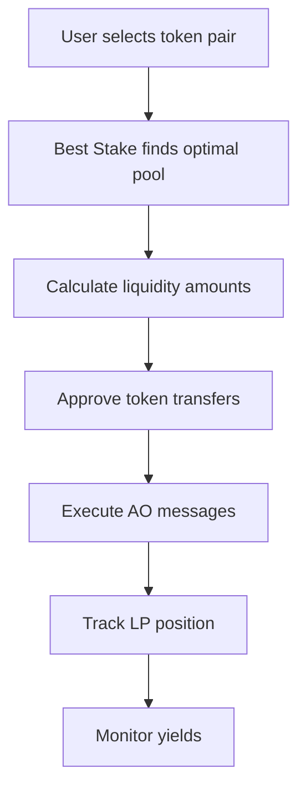

# Yielder - Decentralized Liquidity Protocol

Hey there! Welcome to **Yielder**, a cutting-edge DeFi platform that's revolutionizing how we think about liquidity provision across multiple decentralized exchanges. Think of it as your personal liquidity strategist that works tirelessly to maximize your yields.

## 🚀 What Makes Yielder Special?

At its core, Yielder is a **DEX aggregator** built on Arweave's AO (Autonomous Objects) platform. Instead of scattering your liquidity across different exchanges manually, Yielder lets you:

- **Unify liquidity** across Permaswap, Botega, and Dexi in one seamless interface
- **Find optimal pools** using our proprietary "Best Stake" algorithm
- **Track everything** with beautiful, real-time dashboards
- **Manage positions** with intuitive add/remove liquidity flows

## 🎯 The Problem We're Solving
Traditional DeFi liquidity provision is fragmented. You might have tokens on Uniswap, SushiSwap, and PancakeSwap, but tracking yields, managing positions, and finding the best opportunities becomes a nightmare. Yielder consolidates this into one powerful platform.

## 🔥 Key Features

### 1. **Multi-DEX Integration**
Connect and manage liquidity across:
- **Permaswap** - Arweave-native AMM
- **Botega** - Community-driven DEX
- **Dexi** - High-efficiency trading protocol

### 2. **Best Stake Algorithm**
Our smart algorithm analyzes:
- Current pool ratios and depths
- Historical yield performance
- Gas costs and slippage
- Impermanent loss risks

### 3. **Real-Time Dashboard**
Track your positions with:
- Live P&L calculations
- Pool performance metrics
- Transaction history
- Yield projections

## 🚀 Getting Started

### Prerequisites
- **Node.js** 18+
- **PNPM** (recommended)
- **Arweave wallet** (any supported wallet)

### Installation

```bash
# Clone the repository
git clone <repository-url>
cd yielder

# Install dependencies
pnpm install

# Start development server
pnpm dev

# Open http://localhost:5173 in your browser
```

### Build for Production

```bash
# Build the app
pnpm build

# Preview production build
pnpm preview
```

## 🔧 Development Workflow

### Adding New Features

1. **New DEX Integration**
   - Add DEX enum to `src/types/pool.types.ts`
   - Implement API functions in `src/lib/api.ts`
   - Create DEX-specific components if needed

2. **New Pool Analytics**
   - Add calculation logic to `src/lib/pools.utils.ts`
   - Update dashboard components with new metrics
   - Add to Best Stake algorithm if relevant

3. **UI Components**
   - Use existing Radix UI components when possible
   - Follow Tailwind CSS design system
   - Ensure responsive design and accessibility

### Code Quality

```bash
# Type checking
pnpm typecheck

# Format code
pnpm format

# Lint code (if configured)
pnpm lint
```

## 🌐 How It Works

### The AO Architecture
Yielder leverages Arweave's **Autonomous Objects (AO)** for decentralized computation:

1. **Process-based**: Each pool and user position is an AO process
2. **Message-driven**: All interactions happen via AO messages
3. **Permanent**: Data is permanently stored on Arweave
4. **Composible**: Processes can interact with each other

### Liquidity Provision Flow



### Best Stake Algorithm

The algorithm considers:
- **Pool depth** and **liquidity ratios**
- **Trading volume** and **fee generation**
- **Impermanent loss** risk assessment
- **Gas costs** and **execution efficiency**

## 🔒 Security Considerations

- **Non-custodial**: Your funds remain in your wallet
- **Open source**: Full transparency of algorithms
- **Audited contracts**: All integrated DEXes are audited
- **Permission-based**: Granular wallet permissions

## 📊 Performance & Analytics

### Real-time Metrics
- Pool TVL (Total Value Locked)
- 24h volume and fees
- APY calculations
- Slippage estimates

### Historical Tracking
- Position P&L over time
- Yield farming rewards
- Transaction history
- Performance analytics

## 🎨 Design Philosophy

### User Experience
- **Intuitive**: Complex DeFi made simple
- **Beautiful**: Modern UI with 3D elements
- **Responsive**: Works perfectly on all devices
- **Accessible**: WCAG compliant components

### Visual Identity
- **Dark/Light themes** with system preference detection
- **Consistent spacing** using Tailwind's design tokens
- **Smooth animations** for better user feedback
- **3D network visualization** for landing page

## 🤝 Contributing

We welcome contributions! Here's how you can help:

### Development Setup
```bash
# Fork the repository
# Clone your fork
git clone https://github.com/your-username/yielder.git

# Create feature branch
git checkout -b feature/amazing-new-feature

# Make your changes
# Test thoroughly
# Submit pull request
```

### Areas for Contribution
- **New DEX integrations**
- **Enhanced analytics**
- **UI/UX improvements**
- **Performance optimizations**
- **Documentation**

## 📈 Roadmap

### Phase 1 (Current)
- ✅ Multi-DEX integration
- ✅ Basic liquidity provision
- ✅ Best Stake algorithm
- ✅ Real-time dashboard

### Phase 2 (Upcoming)
- 🔄 Cross-chain liquidity
- 🔄 Advanced yield strategies
- 🔄 Social features
- 🔄 Mobile app

### Phase 3 (Future)
- 🔄 Institutional features
- 🔄 DAO governance
- 🔄 Advanced analytics

## ⚖️ License

This project is licensed under the MIT License - see the [LICENSE](LICENSE) file for details.

---

**Built with ❤️ for the decentralized future**

Yielder is more than just a tool—it's your gateway to sophisticated yield farming in the AO ecosystem. We're excited to see what you build with it! 🚀
