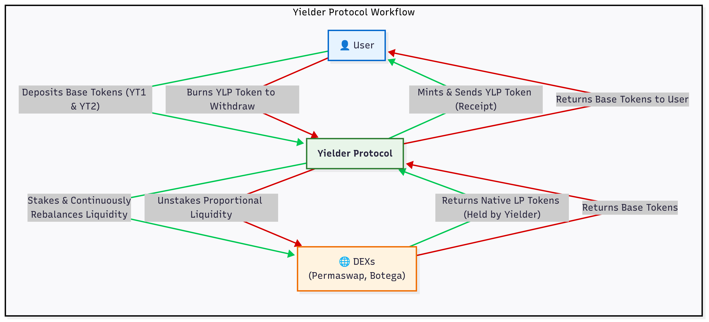

# Yielder Protocol: An Autonomous Cross-DEX Yield Aggregator on ao


**Yielder** is a autonomous yield aggregation and liquidity management protocol built on the AO. It is engineered to abstract away the complexity of liquidity provision, enabling users to effortlessly maximize their returns across a fragmented DeFi ecosystem.

**Website:** `(Link to your website here)`

---

## Table of Contents

- [Abstract](#abstract)
- [How It Works](#how-it-works)
- [Protocol Architecture](#protocol-architecture)
  - [Key Processes & Assets](#key-processes--assets)
  - [Integrated Liquidity Pools](#integrated-liquidity-pools)
- [User Workflow](#user-workflow)
- [Core Handlers (API Reference)](#core-handlers-api-reference)
  - [Data & Analysis](#data--analysis)
  - [Staking & Liquidity](#staking--liquidity)
  - [Utility Handlers](#utility-handlers)
- [Development & Setup](#development--setup)

---

## Abstract

Yielder solves three primary challenges for liquidity providers: the need for constant market monitoring, the high cost of frequent transactions, and the complexity of managing fragmented liquidity positions. By algorithmically analyzing performance metrics like APR, TVL and Swap Fees, Yielder automatically deploys and dynamically rebalances user assets into the most profitable liquidity pools across integrated DEXs **Permaswap** and **Botega**. The entire user position is represented by a single, liquid derivative token (`YLP - Yielder LP Token`), simplifying portfolio management and socializing transaction costs for ultimate capital efficiency.

---

## How It Works

The Yielder protocol operates as a smart, autonomous agent for liquidity providers. It automates the entire yield farming lifecycle—from discovery and analysis to execution and optimization—ensuring user capital is perpetually working in the most productive pools without requiring any active management.

### Yielder Protocol Workflow


---

## Protocol Architecture

The Yielder ecosystem is comprised of several core components that work in synergy.

### Key Processes & Assets

* **Main Yielder Process:** The central smart contract that contains all the protocol's logic. It serves as the user-facing vault, the analytics engine, and the execution layer for all staking and rebalancing operations.
    * **Process ID:** `SpJdYt1_CdMG0W5JjDVYfu-tJNGB2bXC6usBSyrQAys`
* **Yielder Token Suite (YTs):** A set of proprietary utility and liquidity tokens that form the foundation of the Yielder ecosystem.
    * **YT1:** `_IxG5qxfgSBBj1wH7BL0j1vkihOcfx2ntXS19NZjDFU`
    * **YT2:** `Zg8ihIkD2Tpm2E0vRbJSD0J3Jb3dqK8XUZ4OlOZ9kcc`
    * **YT3:** `CgD7STeX0_VDlNwNnB4_qQLg4nb4okqXQgTki0sFXSM`
* **Yielder LP Token (YLP):** The protocol's native derivative LP token. When users deposit assets, Yielder mints and distributes `YLP` as a liquid receipt representing their share of the total assets managed by the protocol.

### Integrated Liquidity Pools

Yielder is integrated with and actively monitors the following liquidity pools across two major DEXs:

* **Permaswap Pools:**
    * **YT1 & YT2 Pool:** `3TFMtVjYssqCuNPIqcIKn-tM4bWq5KtQ9NKweWxvV1w`
    * **YT2 & YT3 Pool:** `7YDBq2EZYQk8o_5Lbm6HcxIYqjWcr65ShmKBHH4XqRU`
    * **YT1 & YT3 Pool:** `bmR1GHhqKJa9MrQe9g8gC8OrNcitWyFRuVKADIKNXc8`
* **Botega/DEXI Pools:**
    * **YT1 & YT2 Pool:** `Q9uyLNaNvuFHvNrQQZ_XuOrRZ6OEE0KqSEPJJj8Z4Ys`
    * **YT2 & YT3 Pool:** `76IKbymu5DvaYaZcbMvEJg_WI9LNzZgzv3vcFmgES2M`
    * **YT1 & YT3 Pool:** `w5UW-qIme4BWojTRQBqFRsweuzWzA-Hy9KExmJM5DMg`

---

## User Workflow

1.  **Deposit:** A user sends their base tokens (e.g., YT1 and YT2) to the main Yielder Process.
2.  **Analyze & Stake:** The user calls the `Stake-User-Token` handler. The Yielder process uses its internal analytics to confirm the best pool and automatically stakes the user's tokens into it.
3.  **Receive YLP:** Yielder mints and sends its native `YLP` tokens back to the user as a receipt for their stake.
4.  **Earn Yield:** The user's assets are now earning fees in the underlying pool. The `cron` and `Auto-Yield-Optimizer` handlers work in the background to ensure the assets are always in the most profitable position.
5.  **Withdraw:** The user calls the `burn` handler, sending their `YLP` tokens. Yielder redeems the underlying assets from the DEX pool and transfers them back to the user.

---

## Core Handlers (API Reference)

The Yielder protocol is controlled by sending messages with specific `Action` tags to the main process.

### Data & Analysis

* `Best-Stake`: Analyzes all relevant pools for a given token pair and returns the one with the optimal yield, considering both APR and TVL.
    * **Tags:** `TokenX`, `TokenY`
* `cron`: A system-level handler (triggered by a cron service) that periodically fetches data for *all* pools, calculates their APRs, and stores the results in `CRONDATAPOOL` for the optimization engine.
* `Auto-Yield-Optimizer`: A powerful handler that iterates through all user stake positions, compares their current pool's APR to the best available APR, and automatically triggers a rebalancing if a significantly better opportunity is found.

### Staking & Liquidity

* `Credit-Notice`: The primary handler for receiving user token deposits. It updates the user's internal balance within the protocol.
* `Stake-User-Token`: The main function for a user to stake their deposited tokens. It calculates `MinLiquidity`, transfers tokens, and calls `AddLiquidity` on the target DEX pool.
* `burn`: The handler for withdrawing liquidity. The user sends their `YLP` tokens, and this function triggers the `remove_liquidity` process on the underlying DEX pool.

### Utility Handlers

* `YT1Airdrop`, `YT2Airdrop`, `YT3Airdrop`: Utility functions for developers and users to easily acquire the base tokens for testing and participation.

---

## Development & Setup

This process is built with Lua for the `ao` Computer. To interact with it, you can use `aos` or any `ao`-compatible SDK.

**Example: Finding the best pool for YT1 and YT2**
```lua
Send({
  Target = "SpJdYt1_CdMG0W5JjDVYfu-tJNGB2bXC6usBSyrQAys",
  Action = "Best-Stake",
  Tags = {
    TokenX = "_IxG5qxfgSBBj1wH7BL0j1vkihOcfx2ntXS19NZjDFU",
    TokenY = "Zg8ihIkD2Tpm2E0vRbJSD0J3Jb3dqK8XUZ4OlOZ9kcc"
  }
})
```

**Example: Staking tokens**
```lua
-- (Assumes user has already deposited YT1 and YT2 into the Yielder process)
Send({
  Target = "SpJdYt1_CdMG0W5JjDVYfu-tJNGB2bXC6usBSyrQAys",
  Action = "Stake-User-Token",
  Tags = {
    User = "YOUR_USER_ADDRESS",
    PoolAddress = "3TFMtVjYssqCuNPIqcIKn-tM4bWq5KtQ9NKweWxvV1w", -- Target pool
    TokenXAddress = "_IxG5qxfgSBBj1wH7BL0j1vkihOcfx2ntXS19NZjDFU",
    TokenXQuantity = "100000000000000", -- 100 YT1 in smallest units
    TokenYAddress = "Zg8ihIkD2Tpm2E0vRbJSD0J3Jb3dqK8XUZ4OlOZ9kcc",
    TokenYQuantity = "115384615384600"  -- 115.38 YT2 in smallest units
  }
})
```